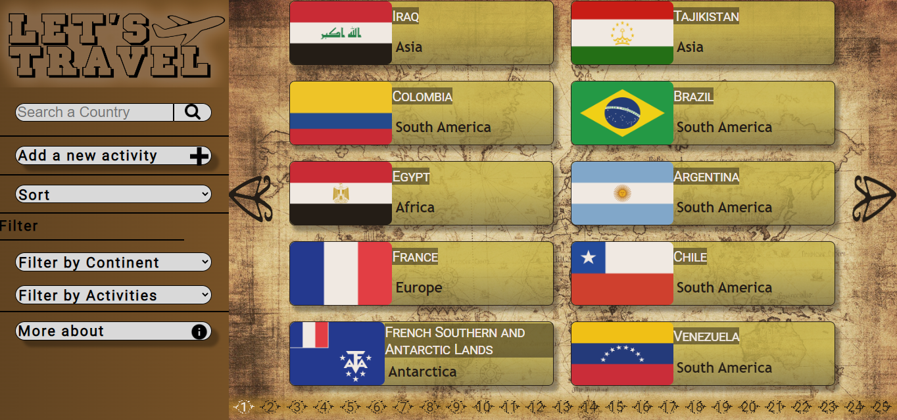

[+%7B%7D;render+%3CGitProfile%2F%3E;npm+start)](https://git.io/typing-svg)

<h1 align="center">Hola 👋, soy Gabriel Jalil (Jalu)</h1>
<h3 align="center">Un apasionado desarrollador web de Argentina</h3>

- 💬 ¿Quién soy yo? **Soy un apasionado por el desarrollo web y la logica de programación con el deseo constante de aprender y trabajar en equipo.**

- 🤔 Algunos de mis hobbies: **Cocinar, construir cosas con madera, tocar el piano y jugar juegos de mesa y Rol (estilo D&D)**

- 📝 ¿Quieres contactarme? **Puedes hacerlo a través de Linkedin https://www.linkedin.com/in/jalugj/ o vía email gabriel.i.jalil@gmail.com**

- 📫 Estudios actuales **En este momento estoy ingresando al mundo de TypeScript y React Native**

---

<h3 align="left">Contacta conmigo:</h3>

 <h2>Correo: <a href="mailto:gabriel.i.jalil@gmail.com">gabriel.i.jalil@gmail.com</a> </h2> 
 <h2>LinkedIn:  <a href='https://www.linkedin.com/in/jalugj/' target='_blank'>in/jalugj/</a> </h2>

<h3 align="left">Languages and Tools:</h3>
 

  
  

 
   
 

   

# 👨‍💻 Mis proyectos:

## Script Music 
             

Este es un proyecto grupal hecho junto a otros 7 integrantes cuyo principal objetivo fue el cierre del bootcamp #SoyHenry. Se utilizo la metodologia Scrum para el desarrollo donde mi participacion se enfocó en la coordinacion del equipo, unificacion pesonal, creacion de funcionalidades en el backend, el sistema de pago efectivo y guarda de compras, implementacion de Cloudinary para la gestion de imagener y la creación de la base de datos, entre otras actividade.

 El proyecto presentado nace de la necesidad de otorgar una solución a tener un mejor control de stock junto a las ventas de instrumentos musicales para una ditribuidora de los mismos, y tambien ingresar a la empresa al mercado virtual, permitiendo una mayor comodidad para la compra y venta de instumentos. Teniendo un panel del administrador comodo y util desde la web, tambien le otrogamos una gran comodidad para el cliente teniendo una aplicacion movil en el que poder revisar los productos diponibles junto a ofertas y efectuar compras al simple movimiento del dedo. Se implementó Stripe como medio para facilitar pagos

<h2> A continuación un breve video sobre el proyecto </h2>

<!-- insertar video -->

<h2> Tambien le compartimos unas imagenes del proyecto</h2>

      

<a href='https://github.com/JaluGJ/ScriptMusic'> 📂 Ver repositorio</a> <a href='https://mega.nz/file/55A1kLpB#qRea9x096wFu1YwWxxHtmXYUK0-0ZwYgGgCTxb3fYwg'> 🌐 Ver proyecto </a>

---

## Let's travel

          

Proyecto individual (PI) requerido para la aprobacion del Bootcamp de Henry. Aqui se pone en prueba los conocimientos adquiridos durante el cursado del bootcamp en lo que respecta creacion de una base de datos relacional, la creacion de un Backend que conecte esta base de datos y la correspondiente coneccion con el Frontend para llegar a una SPA completamente funcional

### Algunas imagenes 
  

<a href='https://github.com/JaluGJ/PI_countries'> 📂 Ver repositorio</a> <a href='https://pi-countries-pink.vercel.app/'> 🌐 Ver proyecto </a>

---
